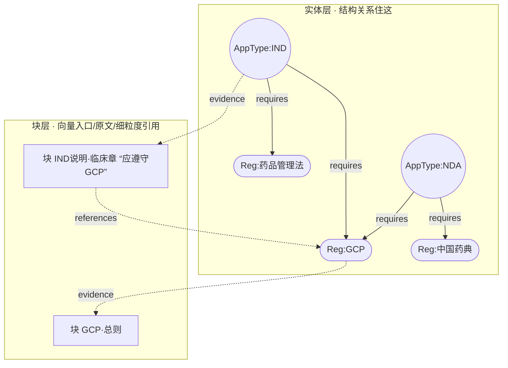
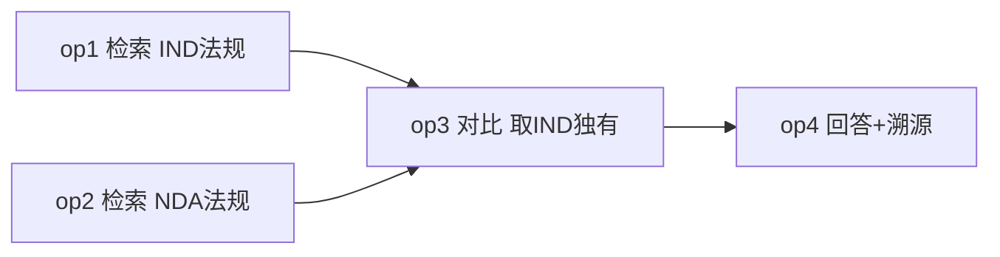
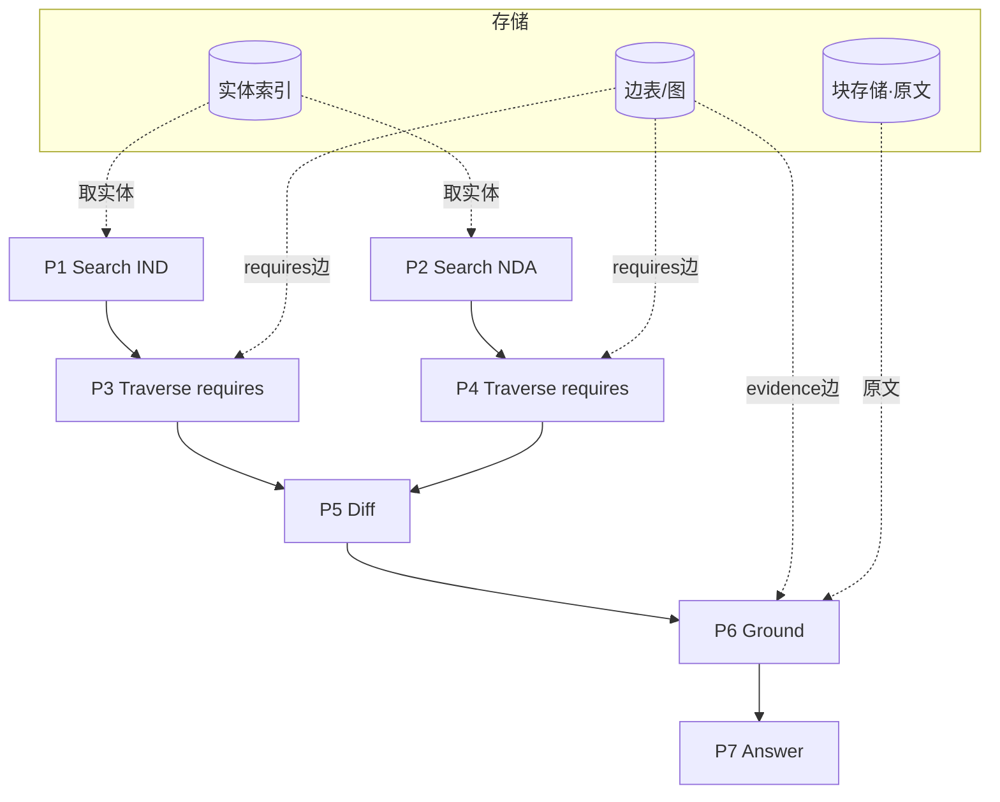
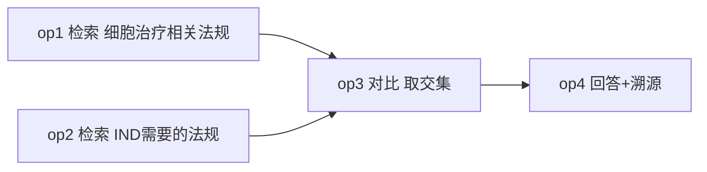
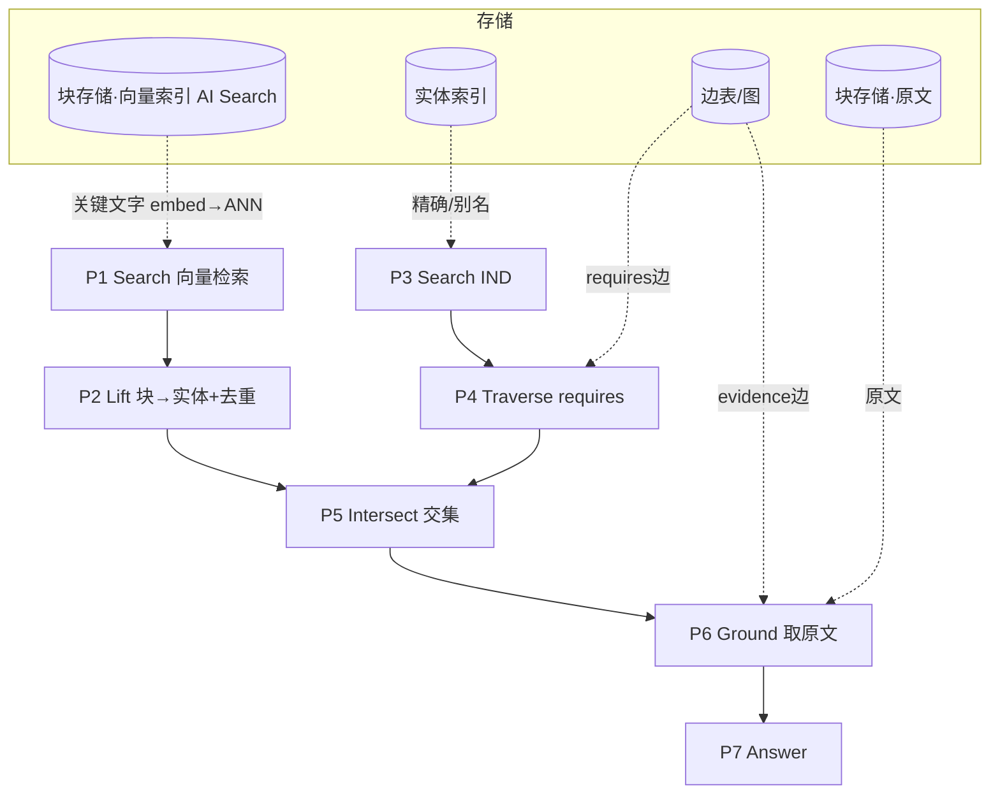

# 法规检索系统设计（v0.2 · 讨论稿）

> 主线：**两层图（实体层 + 块层）** + **大模型编译出可见的算子 DAG（SQG）→ 优化器 → 可执行 DAG**。
> 标 **【待定】** 的是继续讨论的决策点。

---

## 0. 设计理念（一句话）

> **大模型把"这个问题该怎么查"编译成一张看得见的算子图(SQG)——每个算子用一句人话说明"这一步想干什么"；优化器把它转成可执行图并做优化；执行发生在"实体层 + 块层"两层图上。全过程可见、可溯源、可排查。**

大模型只负责**想清楚步骤**（写算子、连依赖），不碰执行；具体怎么查、怎么走图，是执行器的事。

---

## 1. 数据模型：两层图

### 1.1 证据层 · 块 Block（向量入口 / 原文 / 溯源）

文档按语义切成 **Block**，每块有唯一层级地址：

```
fullname = 类别_id . 文档_id . 章节_id . block_id
例：IND.药品注册管理办法.临床试验章.b07
```
```jsonc
Block { fullname, text, vector, summary?, keywords? }
```
`fullname` 同时用于：**去重、按文档顺序排序、就近补全（同前缀=同章节兄弟块）、溯源引用**。

### 1.2 实体层 · 概念节点（唯一去重，结构关系住这）

给概念建**唯一实体节点**：`AppType:IND`、`AppType:NDA`、`Reg:GCP`、`Reg:药品管理法`、`Category:细胞治疗`……
- 好处：`GCP` 只有一个节点（不再是"几十个GCP块里指哪个"的含糊）；
- **可枚举 / 反查类关系挂在实体之间**，两端清晰。

### 1.3 两层怎么连：grounding（证据边）

实体 → 它的证据块：`Reg:GCP --evidence--> 块(GCP·总则)、块(GCP·定义)`。
向量检索命中的是**块**（块才有原文和向量），要走结构关系时先"抬升"到实体。



### 1.4 边（关系）：类型 + 方向 + 权重，**只由 LLM 裁定**

共 **5 种边**（有向、带权、带类型），每种都有清楚的中文名（英文为存储用的类型 id）：

| 中文名 | 类型 id | 含义 | 例 |
|---|---|---|---|
| **要求** | `requires` | 申报类型 → 该遵守的法规 | IND → GCP |
| **归类** | `belongs_to` | 法规 → 所属主题分类 | GCP → 细胞治疗 |
| **替代** | `supersedes` | 新版法规 → 被它取代的旧版 | 注册办法(新) → 注册办法(旧) |
| **引用** | `references` | 一条法规文本里提到 / 引用另一条 | 药品管理法 → GCP |
| **出处** | `evidence` | 概念 ↔ 它的原文块（双向：`Ground` 取原文 / `Lift` 抬升） | Reg:GCP ↔ 块(GCP·总则) |

- 每条边：`Edge(源, 类型, 目标, 权重w, 证据)`；**关系只存一次（有向一行），反向靠遍历**（如"谁要求我"不另存）。
- **建边只信 LLM**：便宜手段（相似度/正则）**只负责提名候选对**（保召回），"是不是边、什么类型、方向、权重"全由 LLM 裁定（保精度）。规则/相似度不单独定边。
- 可按需扩展更多类型（如"适用于""定义"），机制相同。

> 另有一张"免费"的**结构树**（来自 fullname 层级），管"放大到本章/本文、找兄弟块"，用于就近补全。

---

## 2. 索引期（离线构建）

```
原始法规文本
  → ① 语义切块，赋 fullname          （结构树天然成型）
  → ② 抽实体并归一 → 实体层节点        （GCP 的多种写法归一到 Reg:GCP）
  → ③ LLM 建边：候选提名 + LLM 裁定    （实体层结构关系 + 块层细粒度引用）
  → ④ 向量化每个块
  → ⑤ 落库：AI Search(块向量+字段) + 边表/图存储(实体层+关系)
```

---

## 3. 在线检索：SQG 编译 → 优化 → 执行

### 3.1 分两个层次（这是关键，别混）

| 层次 | 谁产出 | 是什么 | 例子 |
|---|---|---|---|
| **逻辑算子（SQG）** | **大模型** | "这一步**想干什么**"，一句人话说清；算子间依赖=思考顺序 | 检索 / 关联 / 对比 … |
| **执行零件** | **优化器 / 执行器** | 底层机械动作，大模型不用管 | Search(一次 AI Search 调用) / Lift / Ground / Traverse / 集合运算 |

大模型只写第一层，**不碰执行**；出错时可展开第二层排查。

### 3.2 逻辑算子目录（先留这一小把，够用再加）

| 算子 | 大模型这一步想干的事 |
|---|---|
| **检索 Retrieve** | 找出与某描述相关的内容 / 对象（如"IND 需要的法规"） |
| **关联 Relate** | 从已有结果顺藤摸瓜找有关系的对象（如"这法规**适用于**哪些申报""被谁**替代**"） |
| **筛选 Filter** | 从结果里按条件留一部分（如"只留现行有效的"） |
| **对比 Compare** | 比两组的异同 / 找各自独有 |
| **汇总 Summarize** | 概括归纳一堆内容 |
| **校验 Verify** | 检查结果全不全、对不对（可有界回环重来） |
| **回答 Answer** | 综合成答案并标出处（fullname 溯源） |

> **【待定】** 算子集**固定**、不让 LLM 造新算子（造了没人能安全执行＝动态代码＝需沙箱，太险）。"加工类"算子内部调 LLM 也是**固定代码 + 模板提示词**，非任意代码。实现时从这把里挑子集。

### 3.3 算子的 JSON（大模型只填这三样）

```jsonc
{ "id":"op3",
  "op":"对比",
  "desc":"从 op1、op2 里找各自独有的法规",   // 人话：这一步在想什么（给人看）
  "inputs":["op1","op2"] }                 // 依赖谁 = 思考顺序
```

### 3.4 优化器（SQG → 可执行 DAG）

1. **校验/纠错**：算子输入输出合不合法、**必须无环**、参数合规；非法就打回/自动修。
2. **绑定物理实现**：把每个**逻辑算子**展开成一串**物理算子（执行零件）**——见 §3.6 映射。
3. **优化**：谓词下推（条件压进检索早筛）、公共子表达式复用（同一检索只算一次）、独立分支并行、算子融合、惰性取原文、结果缓存、预算分配。
4. **执行**：拓扑序跑；`校验` 不过可有界回环重规划。

> 注意术语：`Search / Lift / Ground / Traverse / 集合运算…` 都是**物理算子（执行零件）**，不是逻辑算子；大模型看不到它们。

### 3.5 物理算子（执行零件）目录

> 原则：**Design for AI Search——AI Search 做得好的（检索/过滤/重排/排序）不重做，塌缩成一个 `Search` 算子；只自建 AI Search 不做的（图关系、集合、校验、LLM 编排）。**

**① `Search` —— 一次 AI Search 调用（吞掉一大批"算子"）**

旧设计里的 `Resolve / Seed / ScanEntities / FilterField / Rerank / TopK / SortByFullname / Threshold` **全是同一个 `POST /docs/search` 请求上的字段**，因此合并成一个 `Search` 算子（打块索引或实体索引，由参数决定）：

| 能力 | AI Search 参数 |
|---|---|
| 向量 / 混合检索 | `search` + `vectorQueries` |
| 关键词 / 精确 / 别名 | `search` + Synonym Map |
| 结构化过滤 / 枚举 | `$filter`（可与向量组合、可下推早筛） |
| 语义重排 | `queryType=semantic`（内置 Semantic Ranker，重排 Top-50，**默认折进本调用**） |
| 取前 K / 排序 / 低分排除 | `$top` / `$orderby` / vector `threshold` |

**② 我们自建的算子（AI Search 不做的部分）**

| 组 | 物理算子 | 干什么 |
|---|---|---|
| 图导航 | `Lift` / `Ground` | 块↔实体（沿 evidence 边）；若把边存成字段，单跳也可折进 `Search` 的 `$filter` |
| | `Traverse(edge,dir,hops)` | 多跳图遍历 / 带权扩散（AI Search 非图库）——**真正必须自建** |
| 集合 | `Intersect / Diff / Union / Dedup` | 集合运算（纯内存，跨结果集，AI Search 不做） |
| LLM 加工 | `LLM_Summarize / Extract / Compare / Generate / Judge` | Azure OpenAI，固定模板 |
| 校验控制 | `SetCheck` / `ProvenanceCheck` / `Abstain` | 完整性 / 溯源 / 低置信兜底 |

> 复杂度大降：真正要写的算子从二十几个砍到 **~6 类**；检索侧全是对 `Search` 的薄封装。

### 3.6 逻辑算子 → 物理算子 映射（一对多）

| 逻辑算子 | 展开成的物理零件（`→` 顺序，`│` 二选一） |
|---|---|
| **检索 Retrieve** | (a) 语义：`Search(向量)` → `Lift`　(b) 精确+关系：`Search(精确名)` → `Traverse` |
| **关联 Relate** | `[Lift] → Traverse(edge,dir,hops) → [Ground]` |
| **筛选 Filter** | `Search($filter)` 结构化下推 │ 语义条件用相似度 / `LLM_Judge` |
| **对比 Compare** | `Intersect │ Diff │ Union`（＋要文字异同再 `LLM_Compare`） |
| **汇总 Summarize** | `Ground → LLM_Summarize` |
| **校验 Verify** | `SetCheck ＋ ProvenanceCheck ＋ Abstain` |
| **回答 Answer** | `Ground → LLM_Generate(cite)`（排序用 `Search` 的 `$orderby`） |

> 检索 / 过滤 / 重排 / 排序都在**一次 `Search` 调用**里完成；`Rerank` 默认折进 `Search` 的 `queryType=semantic`，只有**跨源候选**（图遍历/多源合并）才需外部 reranker。

**举例**：
- `检索 "IND 需要的法规"`（精确入口）→ `Search(精确名 "IND")` → `AppType:IND` → `Traverse(requires)` → 法规集；
- `检索 "细胞治疗相关的法规"`（语义入口）→ `Search(向量)` → `Lift` → 法规集。
**同一逻辑算子、两种物理子计划**，优化器按"文字能否对上已知实体名"来选。

### 3.7 透明与可排查（最看重的）
- **执行前**：把 SQG 的图/JSON 给你看＝大模型想走的每一步；
- **执行后**：每个算子回填**实际输出**（命中数、fullname 列表）→ 哪步跑偏一眼定位；
- 能区分是"检索没命中 / 关联走错边 / 对比逻辑错"。

### 3.8 生成与校验
- `回答` 只依据组装好的块作答，**逐条 fullname 溯源**，不增删改法规名；
- 列举类：结果与"应覆盖集合"做完整性核对，缺则回填；
- 低置信 → 返回"未找到确切依据 + 最接近候选"。

---

## 4. 端到端示例（SQG → 优化 → 执行）

两个例子演示**两种"进门方式"**：
- **例①** 入口是**精确实体名**（IND/NDA）→ 走**实体索引**精确匹配，**全程不查向量**；
- **例②** 入口是**语义描述**（"细胞治疗相关"）→ 查 **AI Search 向量库**。

每个例子都分三层看：**① 大模型写的 SQG → ② 优化器产出的物理计划(PEP) → ③ 执行器逐步执行（带真实中间数据）**。

### 4.0 先明确：三层 + 三个存储 + 两种进门

- **三层**：逻辑算子(SQG，大模型写"想干什么") → 物理计划(PEP，优化器绑定+优化) → 执行(执行器跑零件)。
- **三个存储**：
  - **实体索引**：概念节点的名称/别名/属性（供 `Search` 精确查、筛选查 status）；
  - **边表 / 图存储**：所有关系边（要求 requires / 归类 belongs_to / 替代 supersedes / 引用 references / 出处 evidence）（供 `Traverse`、`Ground`）；
  - **块存储**：块的原文 + fullname + 向量（供 `Search` 向量检索、`Ground` 取原文）。
- **一个 `Search` 算子，两种“进门”模式**（同一次 AI Search 调用、不同参数）：
  - `Search(精确名)` → 实体索引做精确/别名匹配（关键词，**不查向量**）；
  - `Search(描述)` → 块向量索引做 ANN（**查向量**）。
  - 优化器判据：**“检索”算子的文字能否对上一个已知实体名** → 能走精确模式，不能走向量模式。

---

### 4.1 例① 精确入口

> **问题："IND 要求、但 NDA 不要求的法规有哪些？"**

#### ① 大模型写的 SQG（只说想干什么）

```jsonc
op1 检索 "IND 需要的法规"                       // 入口=精确名 IND
op2 检索 "NDA 需要的法规"                       // 入口=精确名 NDA
op3 对比 从 op1、op2 取"IND 有、NDA 没有的"      inputs:[op1,op2]   // 差集
op4 回答 组装并溯源                             inputs:[op3]
```

大模型到此为止：它只画了"分别取两边法规 → 求差集 → 回答"，**不知道向量、图、集合运算**。

#### ② 优化器 → 物理计划(PEP)

**a. 校验**：无环 ✓；`对比` 需两个输入 ✓；类型合法（AppType 才能被"检索其法规"）✓。

**b. 绑定**（把每个逻辑意图翻成执行零件）：
- `op1 检索IND法规` → `Search("IND")→AppType:IND` ➜ `Traverse(requires, out)`；
- `op2 检索NDA法规` → `Search("NDA")→AppType:NDA` ➜ `Traverse(requires, out)`；
- `op3 对比` → `Diff(集合, 按 Reg 实体id)`；
- `op4 回答` → `Ground(取原文块)` ➜ 排序 ➜ `LLM(模板)+溯源`。

**c. 优化**：
- **惰性取原文（Ground 后置）**：中间的 IND/NDA 全量法规**只取实体 id 做差集，不取原文**；只有最终幸存者才 Ground。
- **并行**：op1、op2 两条分支互不依赖 → 同时跑。
- **缓存**：`AppType:IND 的 requires 集合`可缓存复用。

**d. 产出的 PEP：**
```
P1 = Search("IND") → AppType:IND            ┐并行
P2 = Search("NDA") → AppType:NDA            ┘
P3 = Traverse(P1, requires, out) → 只要 id    ┐并行
P4 = Traverse(P2, requires, out) → 只要 id    ┘
P5 = Diff(P3, P4)          // 集合差，纯内存，不碰存储
P6 = Ground(P5)            // ★只对最终结果取原文块
P7 = Answer(P6)            // 排序 + 模板LLM + fullname 溯源
```


**每个物理算子的数据来源：**

| 算子 | 输入（来自上一步） | 访问的存储 | 取到什么 |
|---|---|---|---|
| P1 Search("IND") | 查询词 "IND" | **实体索引**（精确/别名） | `AppType:IND` |
| P2 Search("NDA") | 查询词 "NDA" | **实体索引** | `AppType:NDA` |
| P3 Traverse | P1 的实体 id | **边表**（requires 出边） | IND 法规 **id 集**（10 条，只 id） |
| P4 Traverse | P2 的实体 id | **边表** | NDA 法规 **id 集**（28 条，只 id） |
| P5 Diff | P3、P4 输出 | **无**（内存计算） | IND−NDA 的 id 集 |
| P6 Ground | P5 的 id | **边表**(evidence)+**块存储** | 幸存法规的证据块(text+fullname) |
| P7 Answer | P6 的块 | **调 LLM** | 答案+溯源 |

> 注意：**全程走关键词模式，没查向量**——因为 IND/NDA 是精确名，`Search` 在实体索引里直接命中。

#### ③ 执行（真实中间数据）

- **P3　IND 法规集（10，只 id）**：药品管理法、药品注册管理办法、生物制品注册受理审查指南、人源干细胞非临床、人源干细胞药学、人源性干细胞临床试验、细胞治疗临床药理学、细胞治疗研究与评价、免疫细胞药学、免疫细胞临床试验。
- **P4　NDA 法规集（28，只 id，节选）**：药品管理法、疫苗管理法、药品管理法实施条例、药品注册管理办法、…注册分类及申报资料要求…、GLP、GCP、GMP、中国药典、eCTD…。
- **P5　Diff（IND − NDA）→ 去掉两边都有的（药品管理法、药品注册管理办法）→ 剩 8 条**：
  ```
  生物制品注册受理审查指南、人源干细胞非临床、人源干细胞药学、
  人源性干细胞临床试验、细胞治疗临床药理学、细胞治疗研究与评价、
  免疫细胞药学、免疫细胞临床试验
  ```
- **P6　Ground**：只对这 8 条取原文块（前面 30+ 条从不取原文）。
- **P7　Answer**：按 fullname 排序，逐条列出并溯源。

**最终答案**：IND 要求、NDA 不要求的法规有 8 部（8 条干细胞/细胞治疗类指导原则 + 生物制品注册受理审查指南），各附 fullname 出处。

---

### 4.2 例② 向量入口

> **问题："和细胞治疗相关的法规里，哪些是 IND 申报要求的？"**
> 妙在一条计划里**两种入口同框**：`细胞治疗`走向量、`IND`走精确。

#### ① 大模型写的 SQG

```jsonc
op1 检索 "细胞治疗相关的法规"     // 语义主题 → 要查向量
op2 检索 "IND 需要的法规"          // 精确类型名 → 不用向量
op3 对比 取交集(op1 ∩ op2)         inputs:[op1,op2]
op4 回答 + 溯源                    inputs:[op3]
```


#### ② 优化器 → 物理计划(PEP)

**绑定**：
- `op1` 的文字"细胞治疗相关的法规"**对不上任何已知实体名** → `Search(向量)`（**向量检索**）→ `Lift`（块→实体）→ 去重；
- `op2` 文字含精确名"IND" → `Search(精确名)` + `Traverse(requires)`；
- `op3` 对比取交 → `Intersect(按 Reg id)`；
- `op4` 回答 → `Ground` + `LLM(模板)`。

**优化**：① `op1(向量)` 与 `op2(精确+图)` **并行**；② **向量检索带元数据过滤**（`type=Reg` 下推进 ANN，少召回噪声）；③ **惰性取原文**（只交集结果 Ground）；④ `Lift` 后**去重**（多个块→同一法规）。

**PEP：**
```
P1 = Search(text="细胞治疗 干细胞 免疫细胞 产品 研究评价 临床 指导原则",
          filter: type=Reg, k=30)          ★向量检索(AI Search 块向量库)
P2 = Lift(P1) → 去重 → 细胞治疗类 Reg 实体集
P3 = Search("IND") → AppType:IND            （实体索引精确查）
P4 = Traverse(P3, requires, out) → IND法规 id集（边表）
P5 = Intersect(P2, P4)                        （集合交，纯内存）
P6 = Ground(P5)                               ★只对交集结果取原文
P7 = Answer(P6)                               （排序+模板LLM+溯源）
```


**每个物理算子的数据来源：**

| 算子 | 输入 | 访问的存储 | 取到什么 |
|---|---|---|---|
| **P1 Search** | 关键文字（见下） | **块向量索引(AI Search)** | 语义命中的一批**块** |
| P2 Lift | P1 的块 | **边表**(evidence 反查) | 块所属的 **Reg 实体集**（去重后） |
| P3 Search | 词 "IND" | **实体索引** | `AppType:IND` |
| P4 Traverse | P3 的实体 id | **边表** | IND 法规 id 集 |
| P5 Intersect | P2、P4 | **无**（内存） | 两集合的交 |
| P6 Ground | P5 的 id | **边表**(evidence)+**块存储原文** | 交集法规的证据块 |
| P7 Answer | P6 的块 | **调 LLM** | 答案+溯源 |

> **P1 被 embed 去查向量库的"关键文字"**：
> `"细胞治疗 干细胞 免疫细胞 产品 研究评价 临床 指导原则"`
> ——由大模型写的"细胞治疗相关的法规"精炼/扩展而来（执行器可再让小模型归一成检索短语）。

#### ③ 执行（真实中间数据）

- **P1 Search（向量命中的块，节选）**：命中《人源干细胞产品非临床研究…》《细胞治疗产品研究与评价…》《免疫细胞治疗产品临床试验…》《干细胞制剂质量控制…》等块。
- **P2 Lift→去重（细胞治疗类 Reg 集，约 10 条）**：
  ```
  人源干细胞非临床、人源干细胞药学、人源性干细胞临床试验、
  细胞治疗临床药理学、细胞治疗研究与评价、免疫细胞药学、免疫细胞临床试验、
  干细胞制剂质量控制、干细胞临床研究管理办法、体细胞临床研究工作指引
  ```
- **P4（IND 法规集，10，只 id）**：含上面前 7 条 + 药品管理法、药品注册管理办法、生物制品注册受理审查指南。
- **P5 Intersect（细胞治疗类 ∩ IND）= 7 条**：
  ```
  人源干细胞非临床、人源干细胞药学、人源性干细胞临床试验、
  细胞治疗临床药理学、细胞治疗研究与评价、免疫细胞药学、免疫细胞临床试验
  （干细胞制剂质量控制/干细胞临床研究管理办法/体细胞… 属 IIT，不在 IND，被交集剔除）
  ```
- **P6 Ground**：只对这 7 条取原文。
- **P7 Answer**：按 fullname 排序、逐条溯源。

**最终答案**：与细胞治疗相关、且属于 IND 申报要求的法规有 7 部（人源干细胞类 + 细胞治疗类 + 免疫细胞类的技术指导原则），各附出处。

---

### 4.3 两例对比小结

| | 例①（精确入口） | 例②（向量入口） |
|---|---|---|
| 进门零件 | `Search(精确名)` | `Search(向量)` |
| 查向量库？ | **否** | **是**（P1） |
| 被查的关键文字 | 直接用名字 "IND"/"NDA" | "细胞治疗 干细胞 免疫细胞 …" |
| 主要存储 | 实体索引 + 边表 | 块向量库 + 边表 + 实体索引 |
| 集合运算 | Diff（差集） | Intersect（交集） |
| 共同点 | 都**惰性取原文**、都**并行**、中间只用 id、最终才 Ground、逐条溯源 | 同 |

> 一句话：**向量负责"语义进门找相关"，实体层关系负责"精确求关系/求集合"，两者在实体层汇合**；每步中间结果都可见，错在哪一眼可查。

---

## 5. 待定决策点（下一步讨论）

1. **切块粒度**：一条法规=一个块，还是细到条款级块？（影响块层引用边密度）
2. **实体类型清单**：实体层要建哪些类型（申报类型 / 法规 / 分类 / 机构 / …）？
3. **边类型清单**：结构关系（requires/supersedes/appliesTo…）与块层引用（references/refines…）各定哪些。
4. **算子最终子集**：7 个逻辑算子里，一期先实现哪几个。
5. **优化器范围**：一期只做"校验+绑定+缓存"，还是也做下推/并行。
6. **评估**：用什么题集与指标衡量"SQG 编译对不对、执行走没走偏"（计划正确率 / 覆盖率 / 漂移率 / 溯源率）。

---

## 6. 定位（与现成方案的差异）

- **对比裸向量 RAG**：不止取 Top-K 相似块，而是"编译出可见的查询步骤 + 在两层图上按意图走"，能多跳、能列全、能溯源、能排查。
- **对比 OG-RAG（超图+集合覆盖）**：我们用**两层图 + 大模型编译的算子 DAG + 优化器/执行器**，把"怎么查"显式化、可视化；更贴合"文档天然层级"和"按问题选择走法"。
- 本质：**可解释的图上检索 + 可见的查询计划**——向量负责"进门"，实体层关系负责"找全找准"，SQG 负责"让思路看得见"，fullname 负责"对齐与溯源"。
